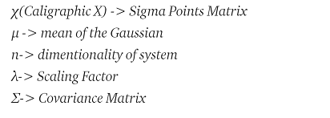

# Unscented Kalman Filter Project 

### Self-Driving Car Engineer Nanodegree Program

# Introduction

The motion model used in the Extended Kalman Filter project was the Constant Velocity (CV) model, which was only concerned with the position (in x and y dimensions) and velocity (also in x and y dimensions) of the vehicle being tracked. 

This model assumes that if the vehicle is in motion, it will continue to move in that way from one moment to the next, and any change in that motion (i.e. acceleration) is modeled by the “process noise.” 

In Unscented Kalman Filter project, we introduced a new motion model: Constant Turn Rate and Velocity, or CTRV.

The CTRV model trades the x and y components of the velocity for a direction and magnitude, and adds in a “yaw rate” component — the change in heading from one moment to the next. Even though the velocity of vehicle might be constant, the heading will be changing (i.e. it a constant yaw rate). This motion model will help to reduce error in our tracking algorithm.

## Unscented Kalman Filter

#### Basic Difference between UKF and EKF
The main difference from EKF is that in EKF we take only one point i.e. mean and approximate the KF, but in UKF we take several points called sigma points that around the expected position and apply our nonlinear transformation to sigma points.

Another difference was that we weren’t given values for our process noise in UKF. This noise was divided into two orthogonal vectors: the acceleration in the direction of the velocity vector, and the acceleration in the yaw direction. The object is to get the “normalized innovation squared” (NIS) — a measure of how noisy your actual measurements are in terms of how noisy you expect them to be based on your covariance — to conform to a “Chi-squared distribution”.

#### Basic Difference between UKF and KF
The main difference between UKF and standard KF is the way we calculate Kalman gain K.
For UKF we based K on cross-correlation between sigma points in state space and measurement space.

#### Unscented Transform

When a Gaussian is passed through a non linear function, it does not remains a Gaussian anymore but we approximate the Gaussian from the resulting figure, so in UKF a process called Unscented Transform helps us to perform this task. To summarize here are the below steps the unscented transform performs:
1. Compute Set of Sigma Points
2. Assign Weights to each sigma point
3. Transform the points through non linear function
4. Compute Gaussian from weighted and transformed points
5. Compute Mean and Variance of the new Gaussian.

#### Computing Sigma Points
The number of sigma points depend on the dimentionality of the system. The general formula is 2N + 1, where N denotes the dimensions.

#### Computing Weights of Sigma Points
The sum of all the weights is equal to 1.

#### Computing Mean and Covariance of the approximate Gaussian

#### Prediction Step

1. Calculate Sigma Points
2. Calculate Weights of Sigma Points
3. Transforming Sigma Points and Calculate new Mean and Covariance

It is very close to the equations mentioned in previous session. Whenever we predict what happens, our uncertainty increases by some amount, because we become a little bit uncertain so we have to take in account the process noise.

#### Update Step

Now here we have an option we can generate the sigma points again because the predicted mean and variance changed and sigma points somehow depend on them or we just continue with the same set of sigma points we generated earlier. For the time being lets take the sigma points we generated earlier only.

We take our state from our state space to measurement state space.

Z is our measurement space i.e. the measurement that is coming from the sensor. So we need a function h which can transform our state space to measurement space so that we can equate them in same units.

#### Calculating Kalman Gain

We are not linearizing the function anymore, therfore we do not have a Jacobian. 
Regarding the Kalman Gain, there is a bit of change here. 

To calculate Error in Prediction: We need to calculate the cross-correlation between sigma points in state space and sigma points in the measurement space.

#### Comparison of Calculating Kalman Gain in EKF and UKF

#### Predicting Final State after calculating Kalman Gain

## Unscented Kalman Filter Project Result

The extended Kalman filter (EKF) is a way of incorporating measurements from multiple sensors to make more robust estimations. It is able to deal with sensors presenting measurements in different dimensions.

#### Initialization paramaters
This project included the option to tune various initialization parameters to improve the final calculated RMSE (root mean squared error). In the `ukf.cpp` file, I changed the default values of `std_a`, `std_yawd`.

* `std_a_`: process noise standard deviation longitudinal acceleration in m/s^2. I settled on a value of 0.5 here, as for a bike (which is what we are detecting in this project) I would not expect very high acceleration.
* `std_yawd_`: process noise standard deviation yaw acceleration in rad/s^2. A big would have to swerve pretty heavily for a big acceleration in yaw, so I settled for PI/4 radians here.

#### Results

Below I included the results of both Dataset1 and Dataset2, as well as the results of my previous [Extended Kalman Filter](https://github.com/shingte/CarND-Extended-Kalman-Filter) for the datasets. 

The x-position is shown as 'px', y-position as 'py', velocity in the x-direction is 'vx', while velocity in the y-direction is 'vy'. Residual error is calculated by root mean squared error (RMSE).

As expected, the Unscented Kalman Filter that uses sensor fusion to combine lidar and radar measurements is the most accurate (lowest RMSE) of the results.

|Dataset1| UKF    | EKF    |UKF Rubrics(<=)|EKF Rubrics(<=)|
| ------ | ------ | ------ | ------------- | ------------- |
|  px    | 0.0598 | 0.0974 |  0.09         |  0.11         |
|  py    | 0.0866 | 0.0855 |  0.10         |  0.11         |
|  vx    | 0.3314 | 0.4517 |  0.40         |  0.52         |
|  vy    | 0.2157 | 0.4404 |  0.30         |  0.52         |

|Dataset2| UKF    | EKF    |
| ------ | ------ | ------ | 
|  px    | 0.0625 | 0.0726 |  
|  py    | 0.0580 | 0.0965 |  
|  vx    | 0.2437 | 0.4219 |  
|  vy    | 0.2048 | 0.4937 |  

#### Consistency Check

The NIS values computed from the radar measurements should roughly obey a chi-square distribution with degrees of freedom equal to the dimension of the radar measurement space (3). 

Similarly, NIS values computed from the laser measurements should roughly obey a chi-square distribution with 2 degrees of freedom. 

A concrete heuristic way to check this is to plot the NIS statistic for the radar or lidar measurements along with the corresponding 95% confidence threshold of the chi-square distribution, which is 7.815 for 3 degrees of freedom (radar) and 5.99 for 2 degrees of freedom (lidar). 

    __LIDAR__
    count    250.000000
    mean       1.784092
    std        1.841548
    min        0.000000
    5%         0.131603
    50%        1.212655
    95%        4.923588
    max       15.656900
    Name: NIS, dtype: float64
    
    __RADAR__
    count    249.000000
    mean       3.271614
    std        7.570231
    min        0.128282
    5%         0.296543
    50%        2.139350
    95%        6.985418
    max      117.043000
    Name: NIS, dtype: float64
    

In the unscented Kalman filter, there was a need to adjust linear acceleration and yaw acceleration noise parameters. The resulting NIS consistency check values for 5th and 95th percentiles are quite close to the expected values 0.352 and 7.815 of the chi-squared distribution with 3 degrees of freedom correspondingly.  It means that these parameters are consistent.

## Instructions

The main program can be built and run by doing the following from the project top directory.

1. mkdir build
2. cd build
3. cmake ..
4. make
5. ./ExtendedKF

Here is the main protcol that main.cpp uses for uWebSocketIO in communicating with the simulator.

INPUT: values provided by the simulator to the c++ program

["sensor_measurement"] => the measurement that the simulator observed (either lidar or radar)

OUTPUT: values provided by the c++ program to the simulator

["estimate_x"] <= kalman filter estimated position x
["estimate_y"] <= kalman filter estimated position y
["rmse_x"]
["rmse_y"]
["rmse_vx"]
["rmse_vy"]

---

## Dependencies

* cmake >= 3.5
  * All OSes: [click here for installation instructions](https://cmake.org/install/)
* make >= 4.1 (Linux, Mac), 3.81 (Windows)
  * Linux: make is installed by default on most Linux distros
  * Mac: [install Xcode command line tools to get make](https://developer.apple.com/xcode/features/)
  * Windows: [Click here for installation instructions](http://gnuwin32.sourceforge.net/packages/make.htm)
* gcc/g++ >= 5.4
  * Linux: gcc / g++ is installed by default on most Linux distros
  * Mac: same deal as make - [install Xcode command line tools](https://developer.apple.com/xcode/features/)
  * Windows: recommend using [MinGW](http://www.mingw.org/)

